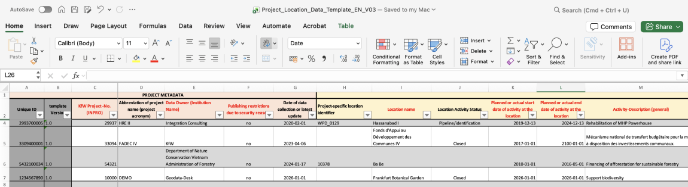
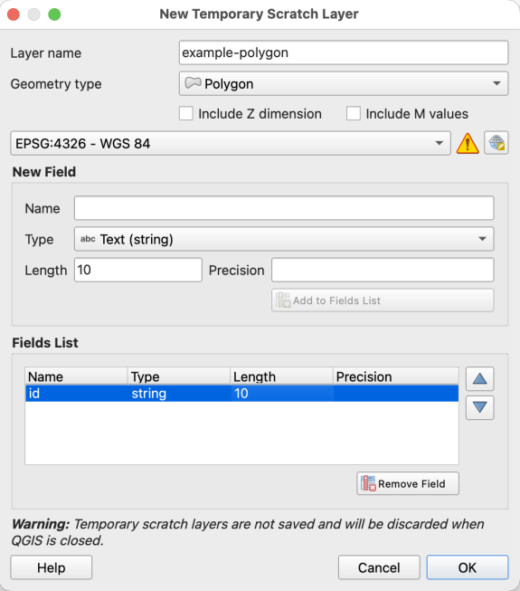
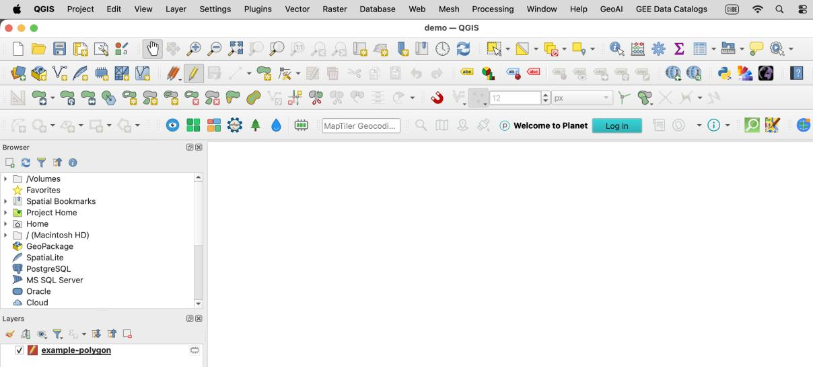
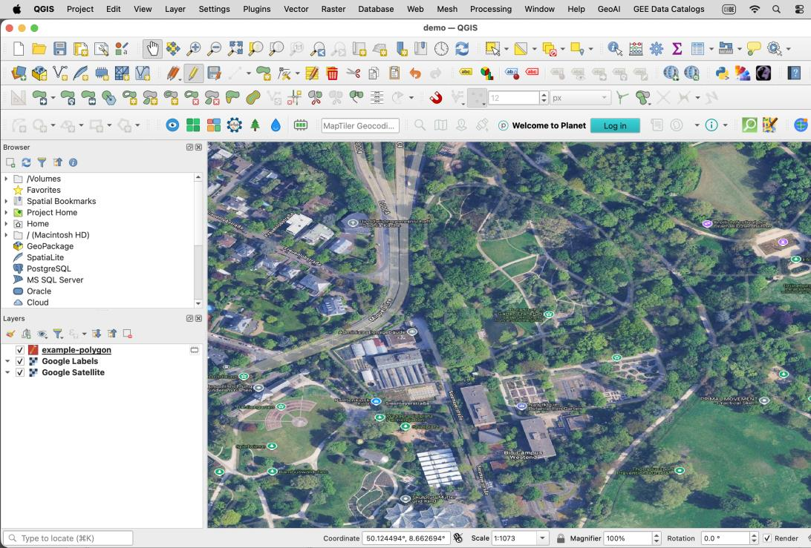
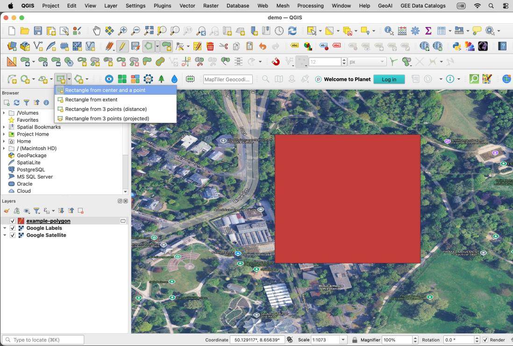
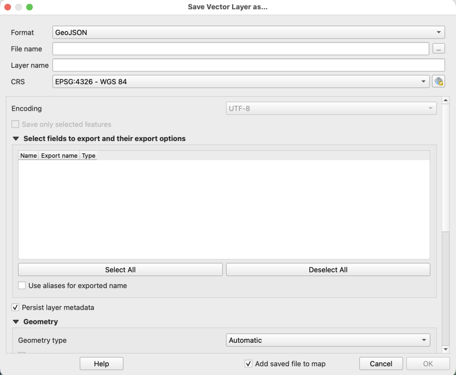
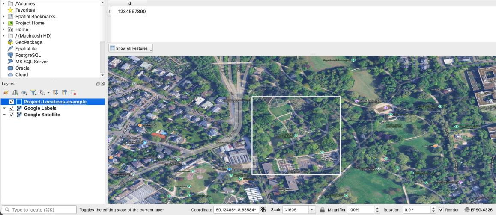
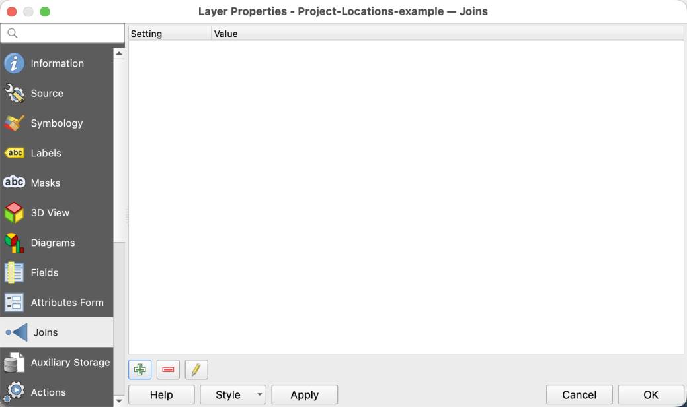
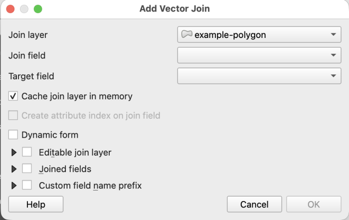
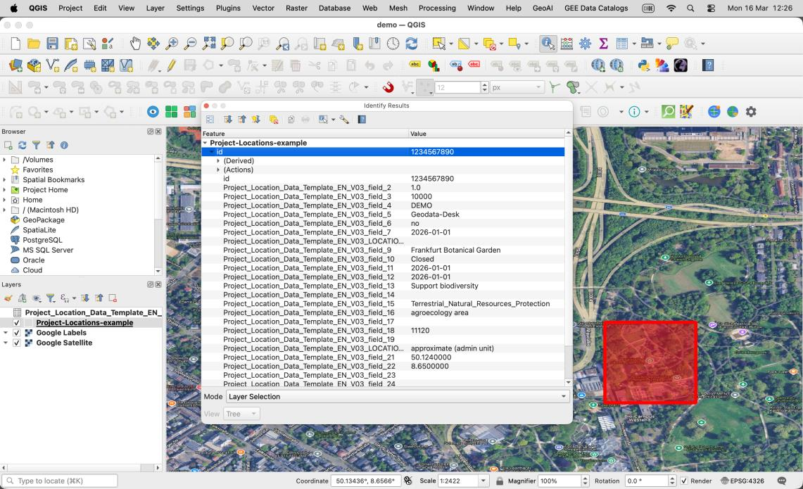

--8<-- "includes/workflow-nav.md"

# Step 1: Collect

!!! overview
    **Tool:** [Project Locations Model (PLM)](https://mapme-initiative.github.io/project_location_model/annex1.html) (v4 as of 01.07.2026)

    **Performed by:** PIA/ external consultant

    **Maintained by:** Geodata-Desk

    **Previous step:** —

    **Next step:** [2 Validate](02-validate.md)

## Purpose

Collect project-level location metadata using the Project Location Model (PLM). Project Locations can be represented by different geometry types (i.e. points, lines, polygons). Regardless of geometry type, a single prepared file is uploaded to the online validator in the next step — the difference is in how the file is prepared, which depends on the Project Locations geometry. Outputs can be in Excel or GeoJSON format.

!!! note "Updating an existing collection?"
    If your team already started collecting Project Locations with an **older version of the PLM and it is not yet uploaded onto the Open Data Platform (ODP)**, please read [Updating existing data](../updating-existing-data.md) first. Then return here for **Points-based** or **Geometry-based** instructions under Procedure.

## Requirements

- Access the latest version of the PLM (download via link under **Tool** in Overview)
- For geometry-based locations: [QGIS](https://qgis.org/) installed

## Procedure

=== "Points-based"

    1. Download and open the PLM

    2. Fill in the project-level location metadata for all of the required columns (indicated in red).  Include values for both the **Latitude** and **Longitude** columns to specify point coordinates.

    3. Save completed PLM (*.xlsx format)

=== "Geometry-based"

    Certain Project Locations are represented as **lines or polygons**, rather than points. In these cases, geometries must be provided, in addition to the PLM, which contains the associated metadata. A common column of data must exist in both the GeoJSON and PLM to establish a connection between the geometries and metadata.

    For demonstration purposes, the examples below use the Frankfurt Botanical Garden (Unique ID value `1234567890`).

    1. Download and open the PLM

    2. Fill in the project-level location metadata with all of the required columns (indicated in red), **excluding** the Latitude and Longitude columns.

        

    3. Start a new QGIS project

        - Select the **New Project** icon, or choose **Project → New** in the menu bar.
        - Select the **Save** icon, or choose **Project → Save**, to create or save the project file.

    4. Create a new layer: **Layer → Create Layer → New Temporary Scratch Layer**

        - Add a **Layer name** (e.g. `example-polygon`)
        - Set **Geometry type** to **Polygon** (or the appropriate type for your locations)
        - Set the **CRS** to **EPSG:4326 – WGS 84** (required for GeoJSON)
        - Create at least one attribute field (e.g. `id`) and select **Add to Fields List**

        This attribute field should contain the same metadata value(s) that appear in the PLM, so that a join can be established between the two files. While field names can differ, the **values must match exactly**. For example, attribute fields named `id` (in GeoJSON) and `Unique ID` (in PLM) both contain the value `1234567890`. Once attributes are defined, select **OK** to confirm.

        

        !!! warning "Join field requirements"
            Values in both attribute fields to be joined must be exact matches:

            - Same data type (e.g. both text/string or both integer)
            - Same case and no extra spaces
            - Ideally, values should be unique or have a 1:1 correspondence

    5. The new layer appears with the editing pencil enabled in the table of contents. The **Toggle Editing** feature can also be activated and deactivated in the toolbar.

        

    6. It generally helps to add a reference dataset to assist with digitizing geometries.

        - Select **Layer → Data Source Manager**, or the **Open Data Source Manager** icon.
        - To add a satellite basemap: **Web → QuickMapServices → Google Satellite**
          - If this option is not visible, activate the **NextGIS QuickMapServices** plugin via **Plugins → Manage and Install Plugins**, then in the plugin settings click **More Services → Get contributed pack**.
        - Zoom to the area where you want to draw the geometry, or enter coordinates in decimal degrees in the **Coordinate** field at the bottom of the window.
        - In this example, the Frankfurt Botanical Garden is located at **(50.124, 8.650)**.

        

    7. Draw polygon features

        - Select the temporary scratch layer in the table of contents.
        - If drawing options are not visible, enable the **Shape Digitizing Toolbar** by right-clicking the toolbar and selecting the correct panel.
        - Select the **Add Polygon Feature** icon in the toolbar.
        - Draw the polygon (circle, rectangle, or custom multi-vertex geometry as appropriate).
        - Right-click to close the polygon when finished.
        - Enter attribute values for the fields created earlier, then click **OK**.
        - Use **Layer → Save Layer Edits** frequently while digitizing.

        

    8. Repeat step 7 to create a geometry for each Project Location.

    9. Export to GeoJSON

        - Click the pencil icon in the toolbar to **stop editing** the layer.
        - Right-click the temporary layer → **Export → Save Features As**.
        - Set format to **GeoJSON**, choose the output path, then click **OK**.
        - The permanent GeoJSON layer appears in the table of contents. You may remove the temporary layer at this point.

        

    10. Right-click the GeoJSON data layer in the table of contents → **Open Attribute Table**.

        

    11. Drag the PLM Excel file from Windows File Manager or Finder into the QGIS table of contents area.

        

    12. Join PLM to GeoJSON

        - Right-click the GeoJSON layer → **Properties** → **Joins** tab → click the **+** button.
        - Select the PLM as the **join layer**.
        - Choose the **join field** (from Excel) and the **target field** (from GeoJSON).
        - Click **OK** to confirm.

        

    13. Verify the join

        - Open the **Attribute Table** of the GeoJSON layer and check **Layer Properties → Information**.
        - Metadata from the PLM should appear in the joined layer.
        - Alternatively, select the **Identify Features** icon and click the polygon to verify joined attributes.

        

## Outputs

| Item                    | Format           | Notes                                          |
| ----------------------- | ---------------- | ---------------------------------------------- |
| File for validation     | Excel or GeoJSON | Multi-geometry Project Locations with metadata |
