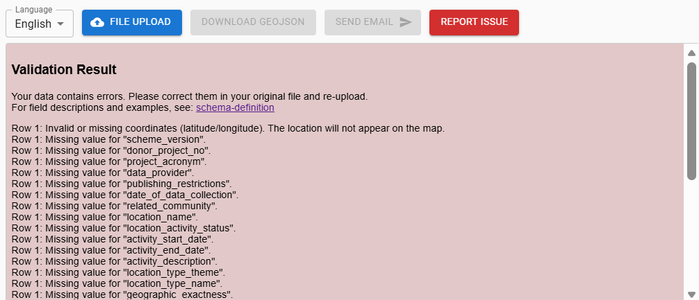
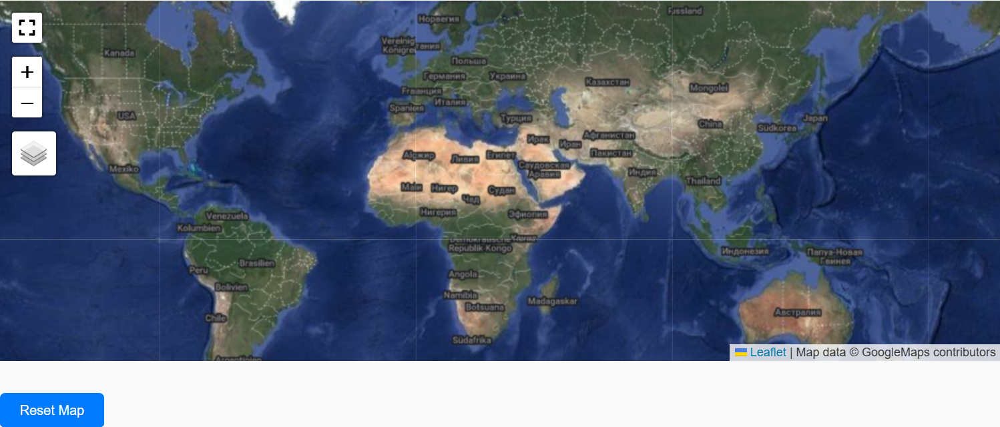
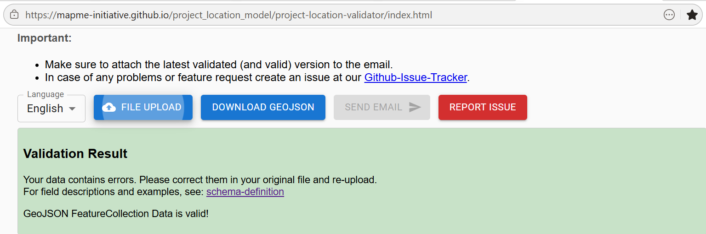
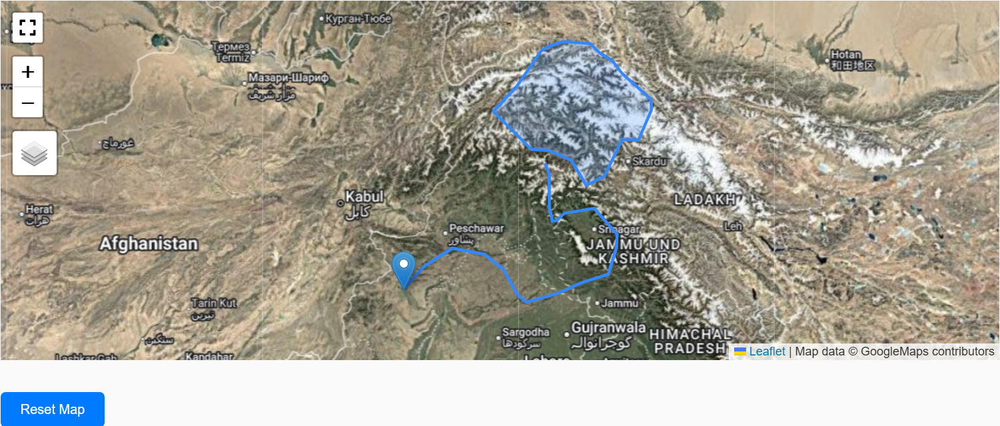

--8<-- "includes/workflow-nav.md"

# Step 2: Validate

!!! overview
    **Tool:** [Online validator](https://mapme-initiative.github.io/project_location_model/project-location-validator/index.html)

    **Performed by:** PIA/ external consultant

    **Maintained by:** ZDV (DAI)

    **Previous step:** [1 Collect](01-collect.md)

    **Next step:** [3 Visual plausibility check](03-visual-plausibility-check.md)

## Purpose

Validate project-level location data from the Collect step. A successful validation produces a GeoJSON file with a timestamp and unique filename.

## Requirements

- Output from [Step 1: Collect](01-collect.md) (Excel or GeoJSON)
- Access to the online validator (link under Tool in Overview)

## Procedure

1. Upload the project-level locations file on the online validator website by selecting the blue File Upload button.

2. Review the validation result on the screen. A failed screening will result in validation errors (red background) indicating the data row where the error occurs in the PLM and a short message describing the type of error - please see examples below. In these cases, please correct the errors and upload the updated file for validation again. 

3. If validation passes, the Download GeoJSON button will change from grey to blue (active). A GeoJSON file with a unique timestamp and filename is generated.

## Examples of validation results

=== "Errors in validation result"

    !!! failure "Validation errors"
        - No Project Locations displayed on the map or displayed incorrectly
        - GeoJSON **will not** be generated; Download GeoJSON button remains grey (disabled)

        Review error messages in the validator and correct source data in the PLM before re-validating.
        

        

        

=== "Error-free validation result"

    !!! success "Validation passed"
        - Multi-geometry Project Locations displayed on the map
        - GeoJSON of the validated file is generated and can be downloaded; Download GeoJSON button changes to blue (enabled)

        

        

## Outputs

| Item | Format | Notes |
|------|--------|-------|
| Validated Project-level Locations | GeoJSON | Timestamp + unique filename required |