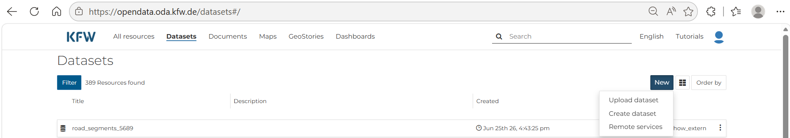
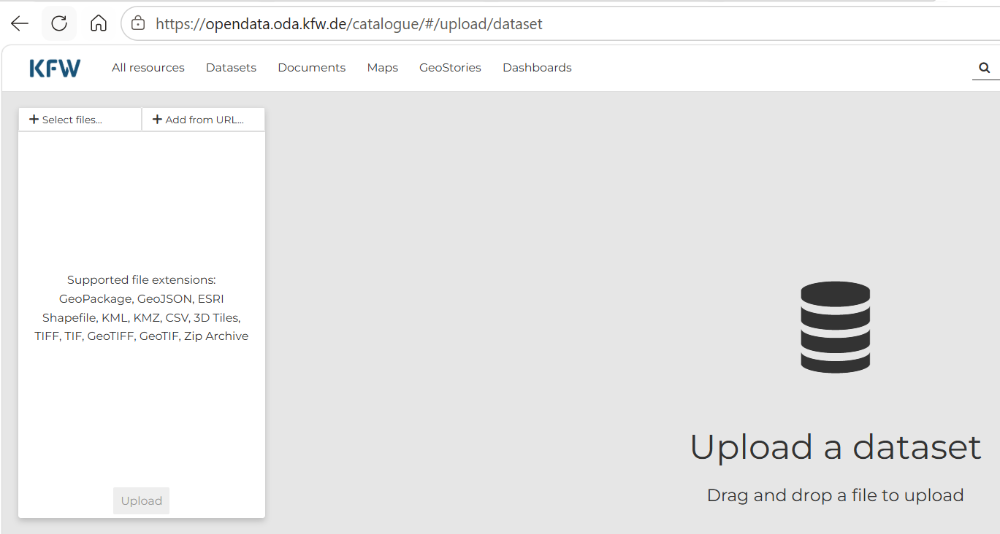
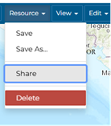
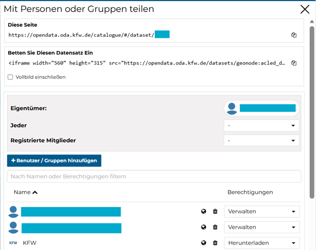
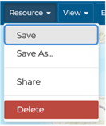

--8<-- "includes/workflow-nav.md"

# Step 4: Upload data

!!! overview
    **Tool:** ODP

    **Performed by:** KfW operations (PM/PA)

    **Maintained by:** ZDV (DAI)

    **Previous step:** [3 Visual plausibility check](03-visual-plausibility-check.md)

    **Next step:** [5 Aggregate data](05-aggregate-data.md)

## Purpose

Upload the validated GeoJSON of project-level locations to the ODP as a data resource, and assign access to colleagues who need to view or work with the dataset.

For all Project Locations, the valid GeoJSON file generated by the validator tool can be uploaded directly to the **ODP**, either by the operations team member responsible for updating Project Locations or with support from Geodata-Desk.

## Requirements

- Confirmed validated GeoJSON from [Step 3: Visual plausibility check](03-visual-plausibility-check.md)
- Log into ODP at least once to be recognized on the platform with access credentials (i.e. email account from any German institution)
- List of KfW colleagues or partners who should have access to the dataset
- Colleagues must have **signed in to ODP at least once** — only users who have accessed the platform before appear in the sharing list

### Requesting support from Geodata-Desk

If support from Geodata-Desk is preferred, send an email with the following information:

| Required information | Details |
|---------------------|---------|
| **Attachments** | **Points-based:** validated GeoJSON or unvalidated PLM |
| | **Lines / polygons:** validated GeoJSON or unvalidated PLM **and** geometry files (if not yet successfully joined) |
| **Access list** | Email addresses of KfW colleagues who should have access to the dataset (each must have signed in to ODP at least once) |
| **Deadlines** | Any urgent deadlines by which the dataset and/or map need to be prepared |

!!! note "PLM errors"
    If there are errors in the PLM that cannot be resolved, contact Geodata-Desk for further support.

### Procedure

1. Open the [KfW Open Data Platform](https://opendata.oda.kfw.de/datasets) and sign in. Select **Datasets** from the top navigation menu, then click the **New** button (top right of the dataset list) and choose **Upload dataset** from the dropdown menu.

    

2. On the **Upload a dataset** page, click **+ Select files…** or drag and drop your validated GeoJSON into the upload area. Supported formats include GeoJSON, GeoPackage, ESRI Shapefile, KML, CSV, and others listed on the page. Click **Upload** to publish the dataset.

    

3. Once Project Locations are uploaded, a **link to the data resource** is generated.

4. Confirm the file appears as an **ODP data resource** and note the resource location for the [Aggregate step](05-aggregate-data.md).

5. To modify access to the dataset (e.g. share with additional colleagues), select **Resource → Share**. Colleagues need to have signed on to ODP **at least once** for their accounts to be visible and assignable.

    *(In German: **Ressource → Teilen**)*

    

6. A pop-up window appears where permissions can be updated for individuals or groups.

    

7. Once each user has been assigned their permissions, **save the dataset**.

    *(In German: **Ressource → Speichern**)*

    

## Outputs

| Item | Format | Notes |
|------|--------|-------|
| Project-level locations dataset | ODP data resource | Project-level locations on ODP; link generated after upload |